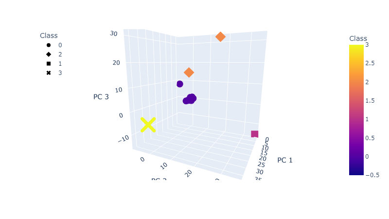
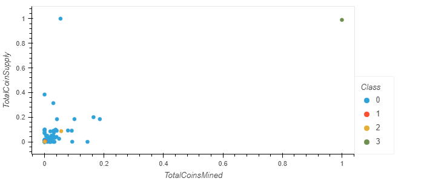

# Cryptocurrencies
 
# Overview
The purpose of this repository is to analyze and categorize cryptocurrency data. Using clustering algorithms and Principal Component Analysis (PCA), we can identify the most similar cryptocurrencies and group them together. The results of this data showed 532 cryptocurrencies can be grouped into 4 distinct groups.

Seen in these screenshots a few cryptocurrencies, including TurtleCoin, BitTorrent, BiblePay and LitecoinCash, are massive outliers in the data and make it difficult to see the other clusters clearly.

